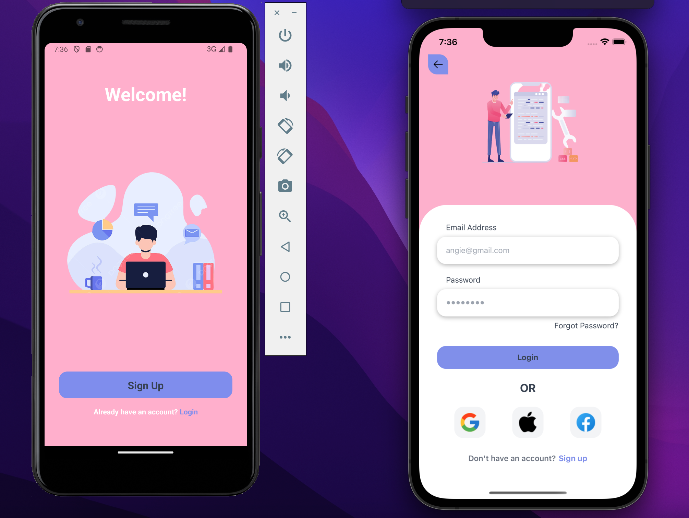

# Auth-UI

<h1 align="center">
    
</h1>

## Install Dev Dependencies
Before you can start the Expo project, you'll need to install its development dependencies. You can do this using either npm or Yarn:

```sh
npm install
```
### OR
```sh
yarn install
```

## Running the App
Once you have the dependencies installed, you can run the app in development mode. This will enable you to see the app on both your device and the Expo app:

```sh
npm start
```
### OR
```sh
yarn start
```
When you run the above command, the app will load in development mode. To view it on your phone, open the [Expo app](https://expo.io) and scan the QR code shown in the terminal. This way, the app will automatically reload when you make changes to the files, and any build errors or logs will be displayed in the terminal.


## Running on iOS Simulator (Mac Only)
If you're using a Mac and have the iOS Simulator installed, you can launch the app on it using:

```sh
npm run ios
```
### OR
```sh
yarn run ios
```
This command is similar to npm start / yarn start, but it also attempts to open the app in the iOS Simulator.

## Running on Android Device or Emulator
To run the app on a connected Android device or emulator, follow these steps:
1. Make sure you have the Android build tools installed. 
2. Refer to the [React Native documentation](https://facebook.github.io/react-native/docs/getting-started.html) for detailed setup instructions.

Run the following command:
```sh
npm run android
```
### OR
```sh
yarn run android
```

